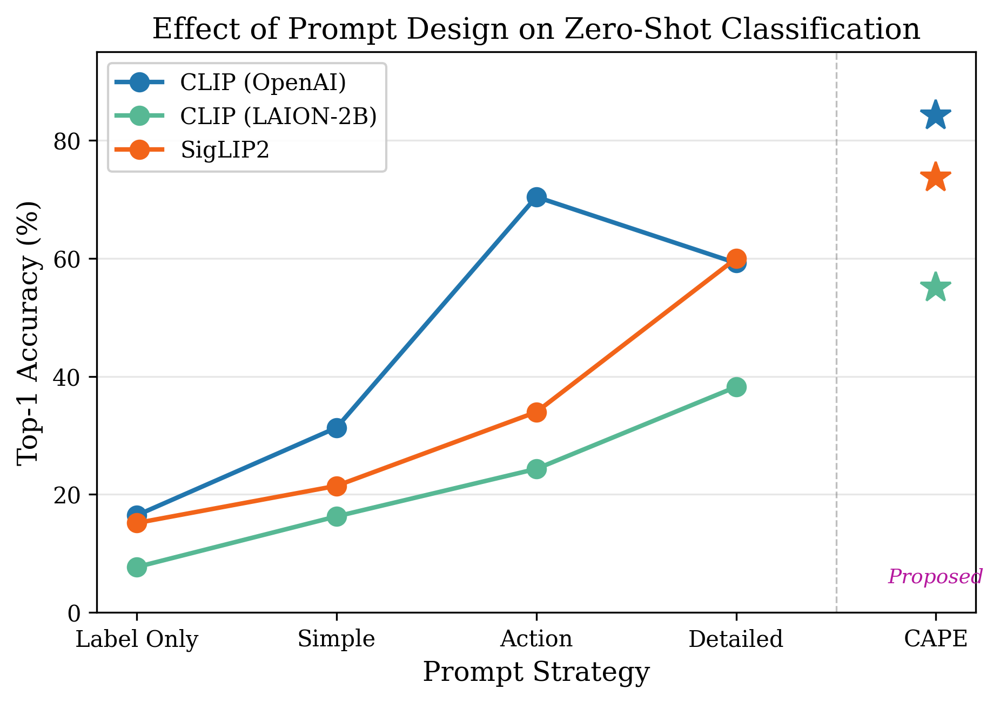
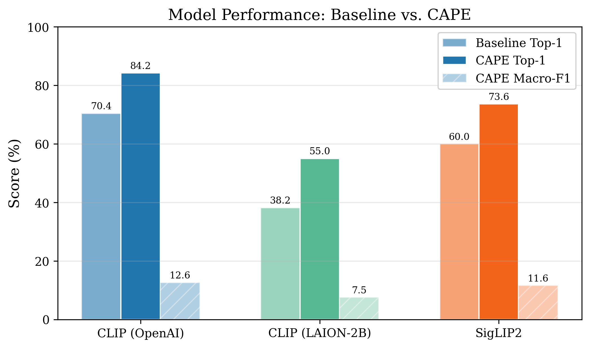
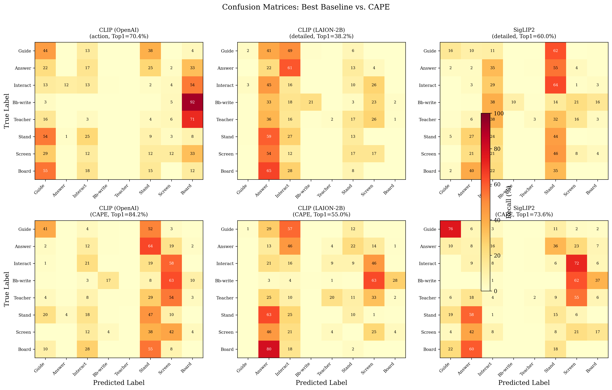
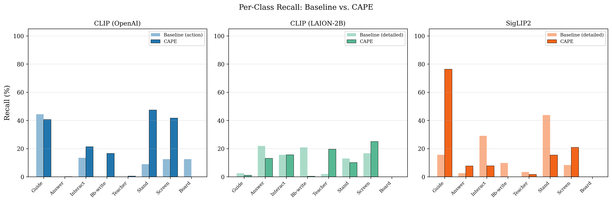

# scb5-zeroshot

[]()
[]()
[](https://huggingface.co/datasets/wintonYF/SCB-Dataset)
[](paper/scb5_zeroshot_paper.pdf)
[]()

**Prompt Sensitivity as an Adversarial Vulnerability in CLIP-Family Models for Zero-Shot Classroom Behavior Analysis**

Yan Ma, Lizhuo Zhang, and Xinjie Wu. Submitted to MDPI Symmetry (Special Issue on Adversarial Machine Learning), 2026.

---

## For Reviewers

```bash
# Quick reproduction from precomputed results:
bash reproduce_paper.sh --mode quick
```

Everything needed is committed in this repository — no external downloads required for the quick path.
See [Quick Start](#quick-start) below for full details.

---

## Overview

CLIP-family models exhibit **instability under prompt variation** in zero-shot classroom behavior analysis. A single model can swing from 95.5% to 31.4% Hit@1 when prompt wording or count changes — without any data or model modification. This repository provides the complete experimental framework to reproduce, verify, and extend these findings.

<p align="center">
  
  <br>
  <em>Figure 1: Prompt ablation analysis across three SCB subsets. CAPE (Context-Aware Prompt Ensemble) stabilizes predictions compared to single-prompt strategies, though sensitivity varies strongly by subset.</em>
</p>

## Key Results

### Best-performing configuration per subset (Hit@1)

| Sub-dataset | Best Model + Prompt Strategy | Hit@1 (%) | Macro-F1 (%) |
|---|---|---|---:|---:|
| **TeacherBehavior** | SigLIP2 + CAPE | 85.56 | 10.07 |
| **HandriseReadWrite** | OpenCLIP + Action prompt | 84.56 | 55.89 |
| **BowTurnHead** | DFN-CLIP + CAPE | 93.27 | 53.95 |

### Model comparison across subsets

<p align="center">
  
  <br>
  <em>Figure 2: Five CLIP-family backbones compared across three SCB subsets. TeacherBehavior (multi-label) shows highest variance and lowest absolute performance; BowTurnHead is near-saturated.</em>
</p>

### Prompt sensitivity leads to inconsistent model rankings

A core finding: **the choice of prompt strategy changes which model appears "best"** on a given subset. For example, on TeacherBehavior, SigLIP2 ranks first under CAPE but drops below CLIP and DFN-CLIP under simpler prompt strategies. No single model dominates across all conditions.

### Misleading leniency of multi-label Hit@1

On multi-label subsets (TeacherBehavior), the lenient Hit@1 metric can saturate above 85% even when Macro-F1 is below 15%, because models collapse predictions into the majority class. This is revealed by confusion matrix and per-class recall analyses:

<p align="center">
  
  <br>
  <em>Figure 3: Confusion matrices for CLIP and SigLIP2 on TeacherBehavior. Both models show strong class-collapse toward "guide" and "answer", inflating Hit@1 while Macro-F1 remains below 12%.</em>
</p>

<p align="center">
  
  <br>
  <em>Figure 4: Per-class recall across three prompt strategies. CAPE partially mitigates class collapse on the minority classes ("blackboard-writing", "teacher", "stand"), but no strategy fully addresses the imbalance.</em>
</p>

## Quick Start

### Environment

```bash
python -m venv .venv
source .venv/bin/activate
pip install -r requirements.txt
```

### Data

Download SCB subsets from [HuggingFace `wintonYF/SCB-Dataset`](https://huggingface.co/datasets/wintonYF/SCB-Dataset). Expected layout:

```
data/
  SCB5_TeacherBehavior/
  SCB5_HandriseReadWrite/
  SCB_BowTurnHead/
```

### Reproduce

```bash
# Quick: regenerate figures and tables from precomputed results
bash reproduce_paper.sh --mode quick

# Full: end-to-end rerun (requires model checkpoints and data)
bash reproduce_paper.sh --mode full
```

### Entry Points

| Command | Purpose |
|---------|---------|
| `bash reproduce_paper.sh` | Canonical entry point (quick or full) |
| `python experiments/main_clip.py` | CLIP-family benchmark (programmatic API) |
| `python experiments/main_mllm.py` | MLLM evaluation |
| `python analysis/paired_bootstrap.py` | Bootstrap significance test |
| `python analysis/cape_principle_ablation.py` | CAPE three-principle ablation |

## Repository Structure

```text
scb5-zeroshot/

├── README.md                       # This file
├── CITATION.cff                    # Citation metadata
├── requirements.txt                # Python dependencies
├── requirements.repro.txt          # Reproduce-specific deps

├── reproduce_paper.sh              # ★ Canonical entry point

├── data/                           # Data loading & precomputed features
│   ├── README.md
│   ├── scb_dataset.py
│   └── feature_cache/

├── analysis/                       # Python package — core analysis code
│   ├── __init__.py
│   ├── paired_bootstrap.py
│   ├── cape_principle_ablation.py
│   ├── cape_robustness.py
│   ├── prompt_data.py
│   ├── run_revision_experiments.py
│   ├── linear_probe.py
│   ├── llm_baselines.py
│   └── prompts/
│       └── setAB_examples.json

├── config/                         # Experiment configuration
│   └── experiment_config.yaml

├── data/                           # Data loading & precomputed features
│   ├── README.md
│   ├── scb_dataset.py
│   └── feature_cache/

├── evaluation/                     # Metrics computation
│   └── metrics.py

├── experiments/                    # Experiment runners

├── models/                         # Model loading
│   ├── clip_zoo.py
│   └── mllm_baseline.py

├── paper/                          # Manuscript, figures, and notebooks

├── prompts/                        # Prompt definitions (A/B/C)
│   ├── cape_prompts.py
│   ├── llm_prompt_gen.py
│   └── prompt_sets.json

├── experiments/                    # Experiment runners
│   ├── main_clip.py
│   ├── main_mllm.py
│   ├── run_benchmark_parallel.sh
│   ├── run_linear_probe_parallel.sh
│   ├── legacy/                     # [LEGACY] superseded scripts
│   └── mllm_ollama/                # Legacy Ollama MLLM orchestration scripts

├── scripts/                        # Utility scripts
│   ├── download_models.py
│   ├── download_scb5_data.py
│   ├── merge_mllm_results.py
│   ├── setup.sh
│   └── summarize_results.py

├── results/                        # All experiment outputs
│   ├── baseline_results.json
│   ├── baseline_eva02_fix_allstrat/
│   ├── mllm/
│   │   ├── mllm_macrof1_all_models.json
│   │   └── mllm_macrof1_supplement.json
│   ├── paper/
│   ├── revision/
│   ├── robustness/
│   └── parallel/

├── paper/                          # Manuscript, figures, and notebooks
│   ├── scb5_zeroshot_paper.pdf
│   ├── cover_letter.pdf
│   ├── generate_paper_figures.py
│   ├── figures/
│   └── notebooks/
│       └── reproduce_figures.ipynb

Additional top-level scripts: `reproduce_paper.sh` (★ canonical entry),
`run_experiment.py` (core experiment library), `pipeline.py` (full pipeline).
Analysis scripts reside in `analysis/`. Utility scripts live in `scripts/`
(`download_models.py`, `download_scb5_data.py`, `setup.sh`, `summarize_results.py`).
Files marked `[LEGACY]` are superseded by `reproduce_paper.sh`.
```

## Key Outputs

| File | Contents |
|------|----------|
| `results/baseline_results.json` | Main benchmark table values |
| `results/paper/benchmark_final_merged.json` | Final merged benchmark summary |
| `results/paper/cape_robustness_summary.json` | Robustness analysis across prompt sets |
| `results/mllm/mllm_macrof1_all_models.json` | Cross-family validation summary (all models) |
| `paper/figures/` | Publication-quality PDF and PNG figures |
| `paper/scb5_zeroshot_paper.pdf` | Full manuscript |

## Data Availability

SCB data are third-party public datasets available at [HuggingFace](https://huggingface.co/datasets/wintonYF/SCB-Dataset) and are not redistributed in this repository. All experiment code, prompt templates, precomputed features, and result files are provided here for full reproducibility.

## Citation

```bibtex
@article{ma2026prompt,
  title     = {Prompt Sensitivity as an Adversarial Vulnerability in {CLIP}-Family
               Models for Zero-Shot Classroom Behavior Analysis},
  author    = {Ma, Yan and Zhang, Lizhuo and Wu, Xinjie},
  journal   = {Submitted to MDPI Symmetry (Special Issue on Adversarial Machine Learning)},
  year      = {2026},
  note      = {Code and data: \url{https://github.com/zhanglizhuo/scb5-zeroshot}}
}
```
