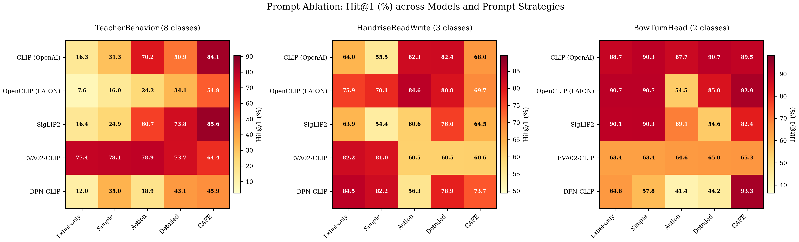
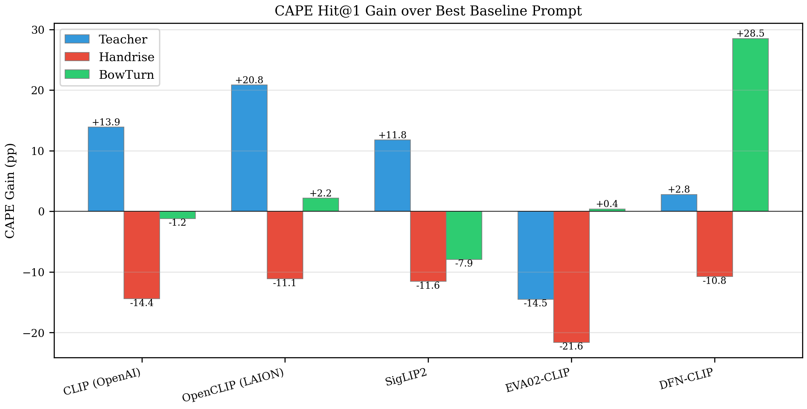

# Prompt Sensitivity Under Semantic Perturbations in CLIP-Family Models for Zero-Shot Classroom Behavior Analysis

[]()
[]()
[](https://huggingface.co/datasets/wintonYF/SCB-Dataset)
[](paper/scb5_zeroshot_paper_revised.pdf)
[]()

**Prompt Sensitivity Under Semantic Perturbations in CLIP-Family Models for Zero-Shot Classroom Behavior Analysis**

Yan Ma, Lizhuo Zhang, and Xinjie Wu. Submitted to MDPI Symmetry (Special Issue on Vision--Language Models and Their Applications), 2026.

---

## For Reviewers

```bash
# Verify cache integrity (CAPE logits vs. canonical text embeddings)
python3 analysis/verify_caches.py

# Quick reproduction from precomputed results:
bash reproduce_paper.sh --mode quick
```

Everything needed is committed in this repository — no external downloads required for the quick path.
See [Quick Start](#quick-start) below for full details.

---



## Overview

CLIP-family models exhibit **instability under prompt variation** in zero-shot classroom behavior analysis. A single model can swing from 85.5% to 31.4% Hit@1 when prompt wording or count changes — without any data or model modification. This repository provides the complete experimental framework to reproduce, verify, and extend these findings. (Figures are available as PDFs in `paper/figures/`.)

## Key Results

### Best-performing configuration per subset (Hit@1)

| Sub-dataset | Best Model + Prompt Strategy | Hit@1 (%) | Multi-label S-F1 (%) |
| --- | --- | ---: | ---: |
| **TeacherBehavior** | SigLIP2 + CAPE | 85.56 | 59.94 |
| **HandriseReadWrite** | OpenCLIP + Action prompt | 84.56 | — |
| **BowTurnHead** | DFN-CLIP + CAPE | 93.27 | — |

TeacherBehavior is multi-label (3--5 labels/image); Hit@1 alone is lenient. The proper multi-label Sample-F1 (59.94%) and Macro-F1 (49--60%) are reported in the paper alongside Hit@1. HandriseReadWrite and BowTurnHead are near-single-label.

### Prompt sensitivity leads to inconsistent model rankings

A core finding: **the choice of prompt strategy changes which model appears "best"** on a given subset. For example, on TeacherBehavior, SigLIP2 ranks first under CAPE but drops below CLIP and DFN-CLIP under simpler prompt strategies. No single model dominates across all conditions.

### Metric asymmetry: Hit@1 hides a large supervised gap

On TeacherBehavior, zero-shot Hit@1 (85.56%) exceeds the supervised linear probe (77.10%). However, in proper multi-label evaluation, the linear probe achieves Sample-F1 88--90% vs. CAPE's 60--66%, revealing that the zero-shot "lead" is an artifact of the lenient multi-label Hit@1 criterion.

### Prompt wording causes >50pp performance swings

SigLIP2 CAPE Hit@1 on TeacherBehavior drops from 85.5% to 31.4% when the only change is an alternate wording of the same CAPE prompt set (Set B), a 54.1 percentage-point gap that exceeds inter-backbone differences. The 30-pair paired-bootstrap test (5000 iterations, Holm--Bonferroni corrected) shows that 16 of 30 pairs remain significant after correction (see `analysis/paired_bootstrap.py`).

### CAPE gain is task-dependent



CAPE improves performance on semantically overlapping categories (TeacherBehavior, BowTurnHead) but degrades it on well-separated actions (HandriseReadWrite, all five models show negative Δ). Richer prompts are not universally better.

## Quick Start

### Environment

```bash
python -m venv .venv
source .venv/bin/activate
pip install -r requirements.txt
```

### Data

Download SCB subsets from [HuggingFace `wintonYF/SCB-Dataset`](https://huggingface.co/datasets/wintonYF/SCB-Dataset):

```bash
python scripts/download_scb5_data.py
```

Expected layout:

```
data/
  SCB5_TeacherBehavior/
  SCB5_HandriseReadWrite/
  SCB_BowTurnHead/
```

### Reproduce

```bash
# 数据下载
python scripts/download_scb5_data.py

# 模型权重下载（需网络）
python scripts/download_models.py

# Verify cache integrity (CAPE logits vs. canonical CAPE Set A text embeddings)
python3 analysis/verify_caches.py

# Quick: regenerate figures and tables from precomputed results
bash reproduce_paper.sh --mode quick

# Full: end-to-end rerun (requires model checkpoints, data, and GPU)
bash reproduce_paper.sh --mode full
```

### Entry Points

| Command | Purpose |
|---------|---------|
| `python3 analysis/verify_caches.py` | **Integrity guard.** Asserts all 15 caches consistent with canonical CAPE Set A |
| `bash reproduce_paper.sh` | Canonical entry point (quick or full) |
| `python experiments/main_clip.py` | CLIP-family benchmark (5 models × 5 prompt strategies × 3 subsets) |
| `python experiments/main_mllm.py` | MLLM evaluation (Qwen, Gemma via Ollama) |
| `python analysis/cape_robustness.py` | CAPE prompt-count / alternate-wording robustness |
| `python analysis/cape_principle_ablation.py` | CAPE three-principle (visual grounding / diversity / discriminative contrast) ablation |
| `python analysis/paired_bootstrap.py` | Paired-bootstrap significance test (5000 iters, seed 42, Holm correction) |
| `python analysis/dev_test_split_eval.py` | Dev/test multi-label threshold stability experiment |
| `python analysis/linear_probe.py` | Supervised linear probe baseline |
| `python analysis/stanford40_eval.py` | External validation on Stanford40 |
| `python analysis/llm_baselines.py` | CuPL + WaffleCLIP literature baselines |

## Repository Structure

```text
scb5-zeroshot/
├── README.md | CITATION.cff | requirements*.txt   # Project metadata
├── reproduce_paper.sh                             # ★ Canonical entry point
├── analysis/                                      # Core analysis (bootstrap, ablation, robustness, ...)
├── data/feature_cache/                            # Precomputed CAPE logits (15 .npz, all 5 backbones)
│   ├── tembs/                                     # Canonical CAPE Set A text embeddings
│   └── README.md                                  # Cache integrity protocol
├── config/ | evaluation/ | models/                # Experiment components
├── experiments/                                   # Runners (main_clip.py, main_mllm.py)
├── paper/                                         # Manuscript + figures (PDF/LaTeX)
├── prompts/                                       # Prompt definitions (A/B/C + uniform strategies)
├── scripts/                                       # Utilities (download, setup, summarize)
└── results/                                       # All outputs (baseline, bootstrap, revision, ...)
```

Key outputs: `results/baseline_results.json` (main Table 7), `results/revision/paired_bootstrap_1785629747.json` (30-pair significance test, Table 13 source), `results/revision/dev_test_split_r3.json` (threshold stability), `results/revision/stanford40_zero_shot_results.json` (external validation), `paper/figures/` (PDF figures), `paper/scb5_zeroshot_paper_revised.pdf` (manuscript).

## Data Availability

SCB data are third-party public datasets available at [HuggingFace](https://huggingface.co/datasets/wintonYF/SCB-Dataset) and are not redistributed in this repository. All experiment code, prompt templates, precomputed features, and result files are provided here for full reproducibility.

## Audit & Integrity

This repository includes several reproducibility guards:

- **`analysis/verify_caches.py`**: Asserts that all 15 `logits_cape` arrays equal `image_features @ tembs.T` (the canonical CAPE Set A text embeddings, tolerance 1e-4). Flags Hit@1 deviations >2.5pp from paper Table 7. Run after any cache modification. 1--2pp open_clip version drift is accepted; the LAION 2.1pp gap (regenerated 52.84 vs. paper 54.94) is documented and unresolved-by-design.

- **Floor values**: The paper's Table 7 caption reports multi-label majority floors computed directly from the released labels (`max(colsum)/N` from `data/feature_cache/*.npz`): 97.16% TeacherBehavior (stand appears in 97.2% of images), 59.13% HandriseReadWrite, 90.69% BowTurnHead. These are independently verifiable.

- **Paired bootstrap**: 5000 iterations, seed 42, Holm--Bonferroni adjusted p-values over the full 30-pair family. 16 of 30 pairs remain significant after correction. See `results/revision/paired_bootstrap_1785629747.json`.

- **Dev/test split**: Multi-label threshold stability verified on a single random half-split; test Sample-F1 differs from full-val by ≤0.42pp across all five backbones (`results/revision/dev_test_split_r3.json`).

## Citation

```bibtex
@article{ma2026prompt,
  title     = {Prompt Sensitivity Under Semantic Perturbations in {CLIP}-Family
               Models for Zero-Shot Classroom Behavior Analysis},
  author    = {Ma, Yan and Zhang, Lizhuo and Wu, Xinjie},
  journal   = {Submitted to MDPI Symmetry (Special Issue on Adversarial Machine Learning)},
  year      = {2026},
  note      = {Code and data: \url{https://github.com/zhanglizhuo/scb5-zeroshot}}
}
```
